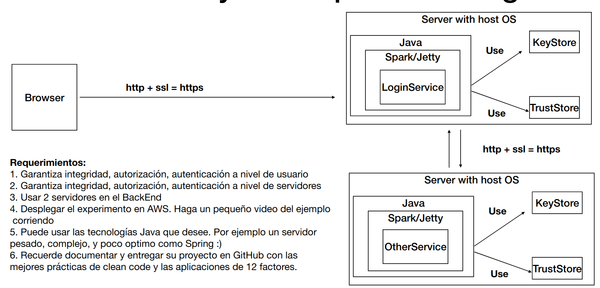

# Lab_Arep_Seguridad

## Descripcion

Repositorio servicio que consume el login [Servicio](https://github.com/Daniel19902/Lab_Arep_Api_Seguridad.git)

Video demostracion AWS [Video AWS](https://youtu.be/h6cFayXmqZE)

Laboratorio en donde nos permite de manera segura realizar peticion atravez 
del protocolo HTTPS a una aplicacion web. El laboratorio nos permite hacer login
y consumir un servicio para sumar dos numeros.

El login funciona de la siguiente manera; se solicitan las credenciales del usuario
las credencias por solicitud POST atravez del protocolo HTTPS cuando se reciven se hace la 
incriptacion de la contraseña para corroborar que el usuario si es quien dice ser.
Una ves comprobada la contraseña se gerena un toquen con el nombre del usuario 
para poder verificar la identidad del usuario para peticiones al servicio de sumar
dos numeros.

Los dos servicios manejan peticioes bajo el protocolo HTTPS donde manejan las llaves privadas y 
trustore.

## Inicio de sesion

## Consumiendo servicio

# Arquitectura

Acapodemos ver la arquitectura que se implemento donde el usuario cunsumo
el login service atravez de https y el login service consume otro servicio
atravez de https haciendo uso de las keystore y trustore

## Author

- [Edward Daniel Porras Martin](https://github.com/Daniel19902)

## Build with

- AWS
- Spark
- Maven

